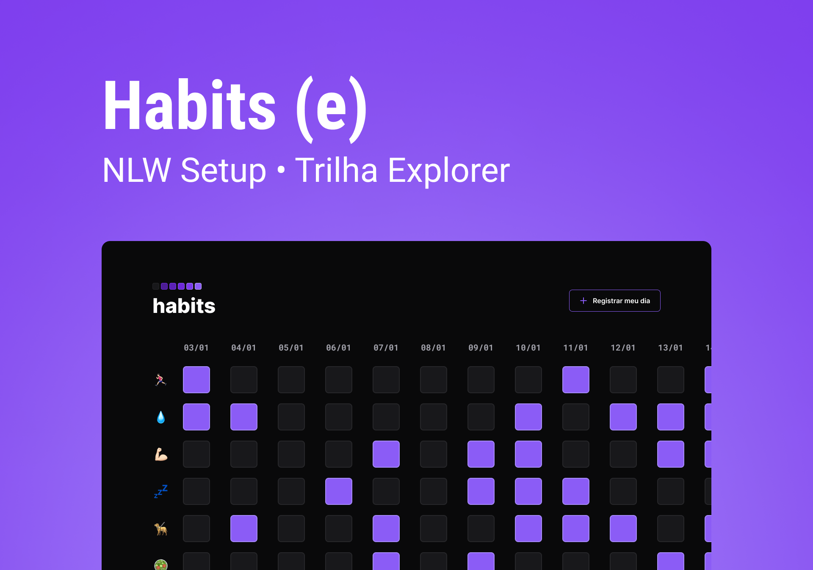

## PROJETO DE HÁBITOS

Desenvolvido durante evento da Rocketseat.

 

## Sobre o Projeto:

Habits é um app para ajudar a rastrear os hábitos.

## Link do projeto:

https://thmenezes.github.io/HabitsNlwSetup/

## Ferramentas utilizadas:

### Autora:

  https://github.com/ThMenezes
